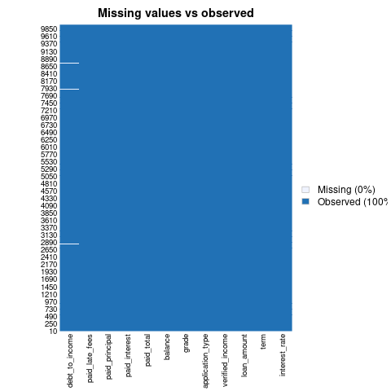
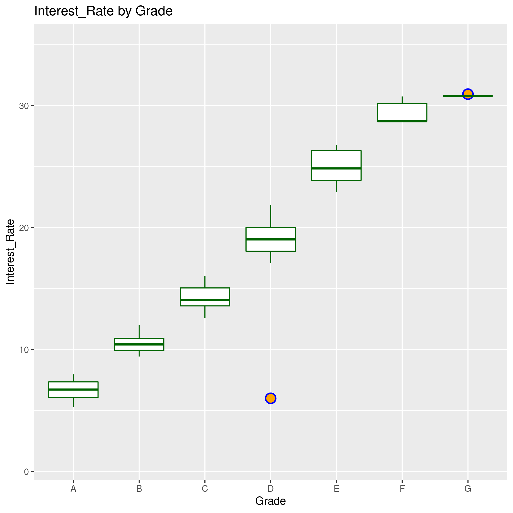
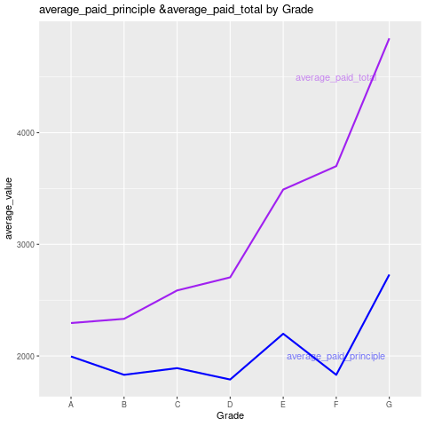
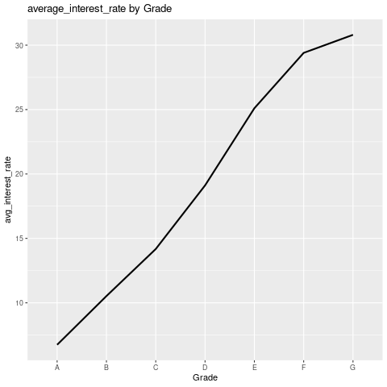
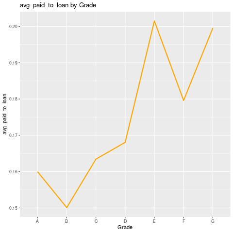
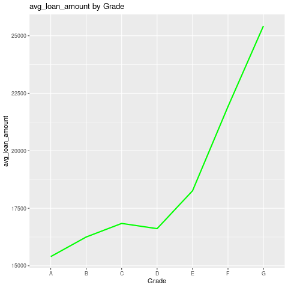
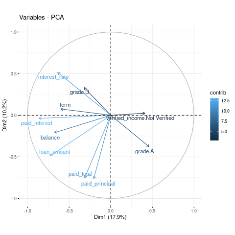

```{r global_options, echo=FALSE, message=FALSE, warning=FALSE}
Sys.setenv(RETICULATE_PYTHON = "/usr/bin/python3")
library(tidyverse)
library(reticulate)
use_python("/usr/bin/python3")
knitr::opts_chunk$set(eval=TRUE, echo=TRUE, warning=FALSE, message=FALSE)
knitr::opts_chunk$set(python.reticulate=T)
```

### Data Overview
This data set represents thousands of loans made through the Lending Club platform, which is a platform that allows individuals to lend to other individuals. Someone who is a essentially a sure bet to pay back a loan will have an easier time getting a loan with a low interest rate than someone who appears to be riskier.
The original dataset can be downloaded from https://www.openintro.org/data/index.php?data=loans_full_schema

The first part of this report will be a general overview of the given data set. We will conduct necessary assumptions and data cleaning in this part.

```{python echo=FALSE}
import pandas as pd
import numpy as np
data = pd.read_csv("loans_full_schema.csv")
#head(data)
data.info
```
As we can find from the result, the data set has 10000 observations on 55 variables. After an initial examination, we can keep only the important variables for the next-step analysis. We should keep the variables which are related to loan amounts (emp_title, interest rate, debt_to_income, term, loan_amount, verified_income, loan_purpose, application_type, grade, balance, paid_total, paid_interest, paid_principal, paid_late_fees)

{width = 50%}
Now we want to analyse the data distribution for each loan grade from "A" to "G"
{width = 50%}
Then we want to investigate the difference of interest rate, paid total, paid principle between different loan grades.
{width = 50%}
{width = 50%}

{width = 50%}
Loan grading is a classification system that involves assigning a quality score to a loan based on a borrower's credit history, quality of the collateral, and the likelihood of repayment of the principal and interest. We can conclude from the above figures that the average interest_rate arises when the loan grade becomes lower. For loan grade from A to G, the average paid total, average paid principle and average paid total to loan percentage increases. To explore the reason of this trend, we also plot the average loan amount by loan grade. From the result we can conclude that the loans which have lower grades usually have larger average loan amounts so that drive up the average paid total amount for the low-grade loans.

### Further analysis
Next, we want to find out which factors have contribute to the value of interest rate.
```{r}
library(knitr)
# All defaults

```
From the above PCA analysis, we can choose the ones that have higher contribution to the model.
conduct linear regression analysis for interest rate
```{r}
library(caret)
#We will be predicting interest rate using the loan records
data <- read_csv("derived_data/loans_tidied.csv")
data <- na.omit(data)
index <- createDataPartition(data$interest_rate, p = .70, list = FALSE)
train <- data[index,]
test <- data[-index,]
lm1 <- lm(interest_rate ~ grade+debt_to_income+verified_income+application_type, data = data)
summary(lm1)
```

All factors except for application_type are statistically significant. The adjusted R square is 0.9516, implying that most of the explanatory variables together significantly explain the interest rate.

```{r}
#build new model
data <- read_csv("derived_data/loans_tidied.csv")
data <- na.omit(data)
lm2 <- lm(interest_rate ~ grade+debt_to_income+verified_income, data = data)
summary(lm2)
```

### Model selection (stepwise)
```{r}
data <- read_csv("derived_data/loans_tidied.csv")
data <- na.omit(data)
lm_new <- step(lm2)
summary(lm_new)
```

### Predicting & Validating the model

To validate the model, we will be looking at the accuracy of the model. This accuracy can be calculated from the classification table.
```{r,message=FALSE}
data <- read_csv("derived_data/loans_tidied.csv")
data <- na.omit(data)
index <- createDataPartition(data$interest_rate, p = .70, list = FALSE)
train <- data[index,]
test <- data[-index,]
lm_train <- lm(interest_rate ~ grade+debt_to_income+verified_income, data = train)
library(Metrics)
#full model
pred <- predict(lm_train, newdata= test)
rmse <- rmse(test$interest_rate,pred)
rmse
```
An RMSE of around 1.08 doesn't seem to be bad giving the range of interest rate is 5 to 31. 
We can conclude from the abve analysis that the lending interest rate can be interpreted by the grade, verified income, debt_to_income.


